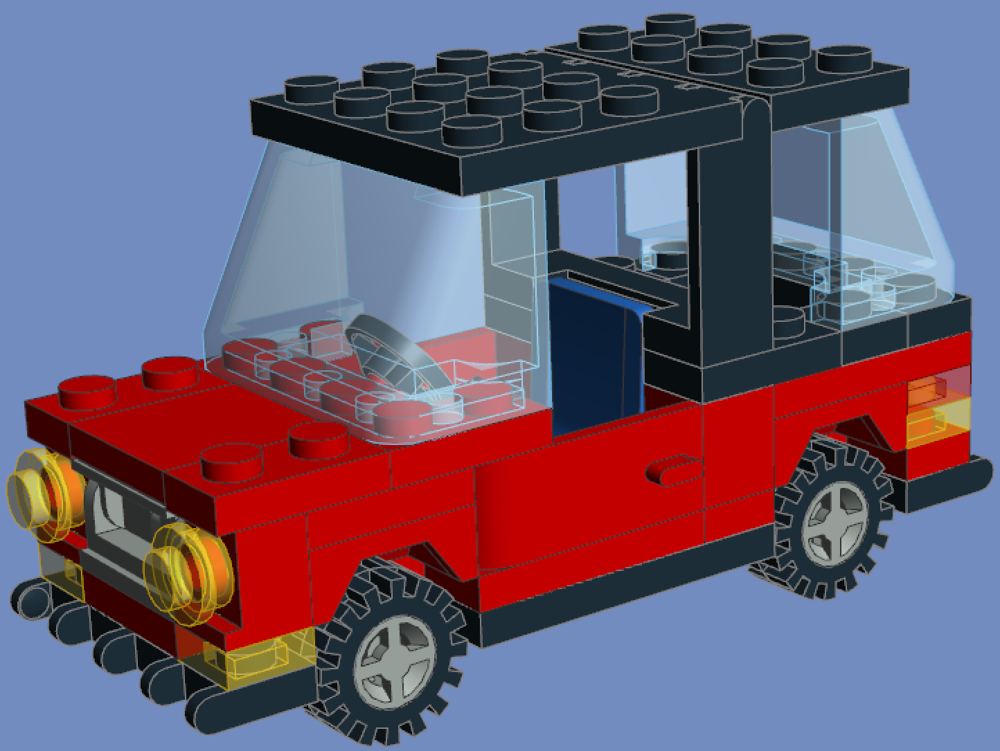
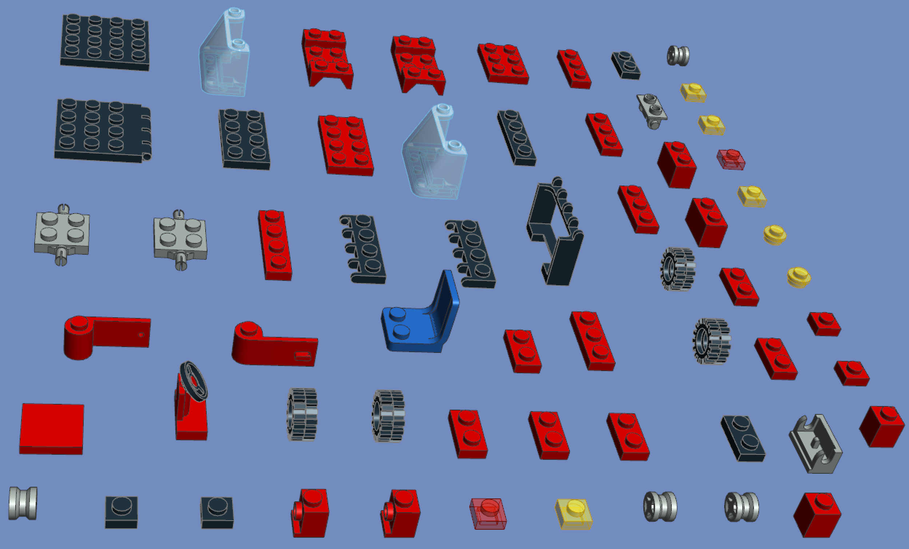

# Parse LDraw file and auto **Explosion** it!

This tiny lib/program can parse ldr file and tore it apart, like **explosion**!

With this beautiful explosion tool, people can share their design to any website/parts sellers or others as part list without consider origin model info leaks.

## Usage:

Download prebuilt one-file-binary for your platform, and drag&drop ldr file on it.

### Preview

| origin |  | explosion |
| ------------- | ------------- | ------------- |
|   | => |  |

### TODO:
1. [ ] code base update.
2. [ ] add support of broken unoffical parts.
3. [ ] add struct to lines.
4. [x] <del>support stud **io** format.(done/optional)</del>

### Build

#### Prerequirement

1. golang 1.16+
2. ldraw parts

#### Build

1. go generate `go run ./generate/generate.go path/to/ldraw/`
2. `make`

